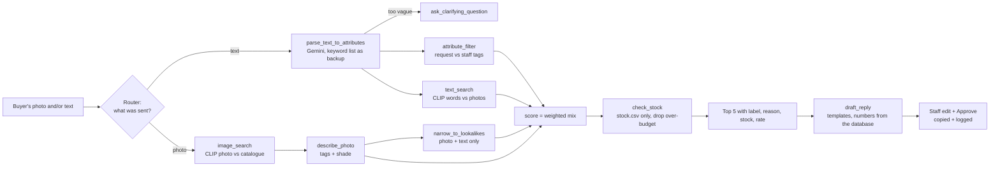

# Swatch Match

**Turn a buyer's WhatsApp enquiry into a shortlist from your own stock, with a reply ready to approve.**

## The problem

Small fabric and saree wholesalers get enquiries on WhatsApp as a photo, a message (often in Hindi, Gujarati or
Hinglish), or both: *"isme blue chahiye"*, *"लाल बांधनी साड़ी 2000 तक"*. Staff then search the shelves from
memory, which is slow and depends on whoever is on duty.

## What it does

1. **Staff paste the enquiry**: a photo, a message, or both. You can choose, drop or paste the photo straight from
   WhatsApp Web.
2. **The app shortlists the 5 closest designs** from the shop's own catalogue. Each one has a label
   (*Very close / Similar / Alternative*), a one-line reason (*"Red bandhani saree as asked, shade darker"*), and the
   real stock and rate from `stock.csv`.
3. **Vague enquiries** (*"kuch accha dikhao"*) get one clarifying question in the buyer's language instead of a
   guess.
4. **Staff tick the designs to offer.** A draft reply appears in English, हिंदी, Hinglish or ગુજરાતી. They edit it
   and press **Approve & copy**, then paste it into WhatsApp. Every approved reply is saved in the **Log**.
5. **Optional, with WhatsApp connected:** buyers' messages arrive in an **Inbox** tab on their own, already matched.
   Staff check the shortlist and tap **Send on WhatsApp**, and the reply and the design photos go to the buyer.
6. **Insights** turn enquiries into business information: reply rate and speed, what buyers ask for, and
   **missed demand**, meaning requests nothing in stock fully matched and best matches that were out of stock. In
   effect it's a restocking list written by the buyers.

It **shortlists, it never decides, and nothing reaches a buyer until staff approve it.**

## How it works



The design choices that keep it reliable:

- **A fixed router, not a free-running AI loop.** The agent looks at what the buyer sent and calls its tools in a
  fixed, explainable order. Every call is shown in the *"How this shortlist was made"* panel. It cannot loop and
  behaves the same with or without the AI.
- **Numbers never come from the AI.** Stock and rate are read only from `stock.csv`. Reply lines that contain
  numbers are filled in by templates.
- **Reasons are computed, not generated.** Labels and reasons come from scores, tags and a simple brightness check,
  so they cannot invent anything.
- **Fallbacks everywhere.** Without a Gemini key, or if Gemini fails, messages are read with a keyword list (English,
  Hinglish, Hindi and Gujarati words, plus budgets like *"under 2000"*, *"2000 se kam"*, *"૨૦૦૦ સુધી"*), photos
  are tagged with CLIP, and questions come from templates. A small *Basic mode* notice tells staff when this happens.
- **Photo + text** (*"this design but in blue"*): the photo picks the 10 lookalike designs and the words re-rank
  them.
- **Score** = `w_image × photo similarity + w_attr × tag match + w_text × CLIP text similarity`. The weights depend
  on what was sent and are set in `config.yaml`.

## Run it on your computer

You need **Python 3.11** and **Node 20 or newer** (22 recommended). No GPU is needed.

```bash
./run.sh
```

Then open <http://localhost:7860>. The first run installs packages, downloads the CLIP model (about 600 MB, one
time only), loads the catalogue and builds the UI.

**Optional, for full mode:** put a free Gemini key from <https://aistudio.google.com/apikey> in `.env`:

```
GEMINI_API_KEY=your-key
```

Without a key everything still works in *Basic mode*.

### Use your own catalogue

1. Put your photos in `catalogue/`.
2. Write `catalogue/stock.csv` with the columns `design_id,image_file,name,quantity_available,rate,unit`.
   `python scripts/fetch_sample_catalogue.py --from-folder` writes a starter file for you.
3. Optionally, add `catalogue/tags.csv` with tags you have checked yourself, one row per design. Use the columns
   `design_id,garment_type,main_colour,secondary_colour,pattern,border,fabric,work_type` and only values listed in
   `config.yaml`.
4. Run `python -m backend.ingest`. Designs without tags get tagged by Gemini, or by CLIP if there's no key. Fix any
   wrong tags in the **Catalogue** tab; your edits are never overwritten.

Run the ingest again whenever stock, rates or photos change. Work already done is skipped.

### Demo mode (for presentations)

Set `DEMO_MODE=1` in `.env` (or in the host's settings):

- **Inbox, no Meta needed:** the Inbox works without a Meta account. **Simulate a WhatsApp buyer** sends six realistic
  buyers through the same code path as real WhatsApp messages: a photo then Hinglish text, Hindi, Gujarati, a photo
  only, a misspelled message and a vague one. Replies are printed in the server log, never sent.
- **Sample week:** a clearly labelled sample week of enquiries fills the Insights tab. It uses real matching with
  made-up buyers and dates, never appears in the Inbox or Log, and **Clear sample data** removes it.
- **One-tap photos:** the Enquiry tab always offers one-tap sample buyer photos.

## Live demo

The live demo runs on the presenter's laptop and is shared through a free **Cloudflare quick tunnel**. There's no
account, no server and no cost.

```bash
./run.sh                                             # 1. start the app on http://localhost:7860
cloudflared tunnel --url http://localhost:7860       # 2. in a second terminal: get a public link
```

`cloudflared` prints a public address like `https://some-random-words.trycloudflare.com`. Anyone with that link
can use the app on a phone or laptop. To install `cloudflared`, download `cloudflared-darwin-arm64.tgz` (Apple
Silicon Mac) from <https://github.com/cloudflare/cloudflared/releases>, unpack it into `~/.local/bin` and run it from
there. Other systems have their own files on the same page.

Things to know:

- **Laptop must stay on:** the link works only while the laptop is awake and both commands are running.
- **New link each time:** every start gives a new random link, so share the new one.
- **Use demo mode:** `DEMO_MODE=1` in `.env` gives judges simulated WhatsApp buyers and the sample Insights week.
- **Set a passcode for a public link:** `STAFF_PASSCODE` in `.env`, then run `./run.sh` again. Otherwise anyone with
  the link can edit stock, prices and tags (saved to `catalogue/stock.csv` on the laptop) and use your Gemini quota.
- **For testing only:** quick tunnels are meant for demos. For daily use, host it as described in *Deploy to
  Hugging Face Spaces* or on a small always-on server.
- **WhatsApp webhooks:** the same link can serve as a temporary webhook URL for testing with Meta's test number
  (`https://<link>/api/whatsapp/webhook`). Update it in Meta whenever the link changes.

## Accuracy

```bash
python evaluate.py --show
```

On a fresh install of the sample catalogue, in Basic mode (no Gemini):

| Enquiry type | Top-1 | Top-5 |
|---|---|---|
| Photo only | 13 / 15 | 15 / 15 |
| Text only (English, Hinglish, हिंदी, ગુજરાતી) | 15 / 15 | 15 / 15 |
| Photo + text | 2 / 2 | 2 / 2 |
| **All** | **30 / 32 (94%)** | **32 / 32 (100%)** |

The two photo misses (D002 and D022) land in the top 5 behind a similar-looking design.

With Gemini on, the score on these clean test sentences is the same. Gemini's gain shows on messy real messages,
which the keyword list misreads: *"bandni wala georjet dupata laal colour mein 1500 tak"* (misspellings) and
*"red nahi chahiye, blue ya green dikhao"* (negation). It also gives better photo descriptions, so reasons can say
*"same pattern and border"*.

**Read this number with care: it uses sample data and edited query photos.** The query photos are cropped, tilted,
re-lit, blurred and recompressed copies of catalogue photos, made by `scripts/make_test_queries.py`.
`evaluate.py` refuses to run if a query photo is byte-identical to a catalogue photo. Real phone photos of real
stock are harder. For a number you can trust, photograph 30 or more real pieces, add them to `test_queries/`, and
list them in `test_queries.csv`.

## Deploy to Hugging Face Spaces

1. Create a new Space: **SDK: Docker**, hardware: **CPU basic (free)**.
2. Push this repository to the Space, for example with
   `git remote add space https://huggingface.co/spaces/<you>/swatch-match` and then `git push space HEAD:main`.
   Use a Hugging Face access token with write permission as the password.
3. In the Space's **Settings → Variables and secrets**, add the secret `GEMINI_API_KEY` (optional) and
   **`STAFF_PASSCODE`**. Set the passcode whenever the app is online, or anyone with the link could open it.

The Dockerfile builds the UI, installs CPU-only PyTorch, downloads CLIP and loads the catalogue at build time, so
the Space starts quickly. **Note:** free Spaces have no permanent disk. Tag edits made in the app and the Log reset
when the Space restarts, so keep checked tags in `catalogue/tags.csv`.

## Connect WhatsApp (optional)

Swatch Match uses Meta's official **WhatsApp Business Cloud API**. Unofficial WhatsApp Web tools break WhatsApp's
terms and can get the number banned, so they are not supported.

**What you need:** the app online at an HTTPS address (the Hugging Face Space above works), and a Meta developer
account (free).

1. Go to <https://developers.facebook.com/apps>, create an app of type **Business**, and add the **WhatsApp**
   product.
2. In **WhatsApp → API Setup**, Meta gives you a free **test number**. Add your own phone under *To* and confirm the
   code, so you can message the test number.
3. Copy these into the Space secrets (or `.env` on your computer):
   - `WHATSAPP_TOKEN`: the access token. The one on the API Setup page expires after 24 h; for real use create a
     permanent *System User* token in Business Settings.
   - `WHATSAPP_PHONE_NUMBER_ID`: the *Phone number ID* on the API Setup page.
   - `WHATSAPP_APP_SECRET`: **App settings → Basic → App secret**.
   - `WHATSAPP_VERIFY_TOKEN`: any password you make up; type the same one into Meta in the next step.
4. In **WhatsApp → Configuration → Webhook**, enter the callback URL
   `https://<your-space>.hf.space/api/whatsapp/webhook` and your verify token, press **Verify and save**, then
   subscribe to **messages**.
5. Send the test number a photo from your phone. It appears in the **Inbox** tab within about 10 seconds.
6. When it works, add the shop's real number in Meta (**WhatsApp → Phone numbers**). A number used with the Cloud
   API can't stay on the normal WhatsApp app at the same time.

**How it behaves:**

- **Photo and text together:** a photo plus the text sent right after it (within 2 minutes, `merge_seconds` in
  `config.yaml`) become one enquiry.
- **Retries:** Meta sometimes delivers the same message twice; the second copy is ignored.
- **Other message types:** voice notes and videos are listed as *unsupported* so staff still see them.
- **The 24-hour window:** WhatsApp only allows free-form replies within 24 hours of the buyer's last message. After
  that, the app says so and staff reply from their phone.
- **What a send contains:** the approved text, then one photo per ticked design (at most 5). Captions carry the
  number, name and ID; prices stay in the text.
- **Costs:** replies within the 24-hour window are free under Meta's current pricing.
- **Free Hugging Face Spaces** sleep when unused and have no permanent disk. Meta retries for a while, so a message
  to a sleeping Space arrives late. The Inbox resets when the Space restarts. For daily use, add persistent
  storage or use a small always-on server.

**Try it without Meta:** set the four `WHATSAPP_*` values in `.env` to any test values, and set
`WHATSAPP_DRY_RUN=1`. Then send yourself fake messages:

```bash
python scripts/fake_whatsapp.py --photo test_queries/q_D010_text.jpg --name "Ramesh Textiles"
python scripts/fake_whatsapp.py --text "isme blue silk chahiye"        # merges with the photo above
```

**Send on WhatsApp** then prints the messages in the server log instead of sending them.

## Project layout

```
backend/
  main.py           API routes; also serves the built UI
  auth.py           optional staff passcode (STAFF_PASSCODE)
  enquiries.py      run an enquiry through the agent and save it (app form and WhatsApp share this)
  whatsapp.py       the ONLY file that talks to WhatsApp (webhook check, parsing, media, sending)
  inbox.py          incoming WhatsApp messages -> enquiries (dedupe, photo + text merge)
  ingest.py         stock.csv + tags.csv + photos -> SQLite (embeddings, tags, stock)
  llm.py            the ONLY file that talks to an LLM (Gemini, or a "none" provider)
  embeddings.py     CLIP model, image and text vectors
  tagging.py        Gemini tags with CLIP zero-shot fallback
  images.py         upload checks (type, size, real format), EXIF rotation, shade check
  db.py             SQLite tables: designs, stock, tags, embeddings, enquiries, wa_seen, audit_log
  agent/
    orchestrator.py the router: which tools, in what order, with a trace
    tools.py        image_search, describe_photo, parse_text_to_attributes, attribute_filter,
                    text_search, check_stock, ask_clarifying_question, draft_reply
    scoring.py      score mix, labels, reasons, shade note
    lexicon.py      keyword list for English / Hinglish / Hindi / Gujarati
    templates.py    reply and question templates in 4 languages
frontend/           React + Vite + Tailwind; Inbox (with WhatsApp) / Enquiry / Catalogue / Log tabs
catalogue/          sample photos, stock.csv, tags.csv, CREDITS.md
evaluate.py         top-1 / top-5 on test_queries.csv
scripts/            sample catalogue fetcher, test query maker, fake WhatsApp sender
config.yaml         thresholds, weights, vocabulary, Gemini model, upload limits
```

API: `POST /api/enquiry` · `POST /api/reply` · `POST /api/approve` · `GET /api/audit` · `GET /api/designs` ·
`PATCH /api/designs/{id}/tags` · `GET /api/health` · `POST /api/login` · `GET /api/inbox` · `GET /api/inbox/{id}` ·
`POST /api/inbox/{id}/dismiss` · `POST /api/whatsapp/send` · `GET|POST /api/whatsapp/webhook`.

## Limits

- **Small CLIP model.** CLIP ViT-B/32 is fast on a CPU but does not know Indian textile terms well: its own
  pattern tags are rough, which is why checked tags matter. Near-identical designs in different colours can swap
  places.
- **Shade.** Colours look different on every phone. The app warns (*"Shade may differ in photo"*) but cannot
  judge true colour.
- **The keyword list** misses misspellings and negation (*"not red"*). Gemini handles these when a key is set.
- **One photo per enquiry**, and one main product per photo.
- **One shared passcode**, not separate staff accounts. The Log does not record who approved each reply.

## What could come next

- Several photos per enquiry, and cropping to the product.
- Fine-tuning CLIP on the shop's own photos to tell close designs apart.
- Reading stock straight from Tally or Google Sheets instead of a CSV.
- Persistent storage on Hugging Face (a dataset repo or a small database) so tag edits and the Log survive
  restarts.
- Approved WhatsApp *message templates*, so staff can follow up after the 24-hour window.
- Separate staff logins, so the Log shows who approved each reply.

## AI tools used

- **In the app:** Google **Gemini 3.5 Flash-Lite** (reading messages, describing photos, clarifying questions; set in `config.yaml`) and
  **CLIP ViT-B/32** via sentence-transformers (photo and text matching, plus fallback tagging).
- **To build it:** **Claude Code** (Anthropic's Claude) wrote most of the code step by step, with each step
  checked in the browser and through the API before moving on.

## Sample data credits

The sample photos come from Wikimedia Commons under open licences. Every source, author and licence is in
[`catalogue/CREDITS.md`](catalogue/CREDITS.md). The stock and rate values are made up.
